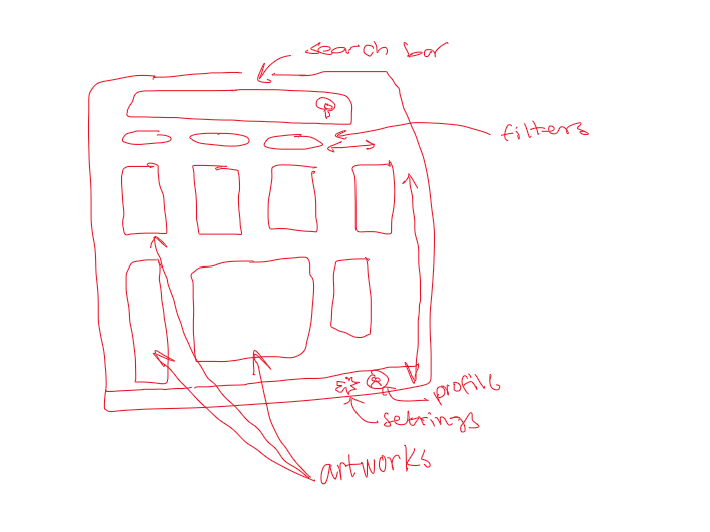
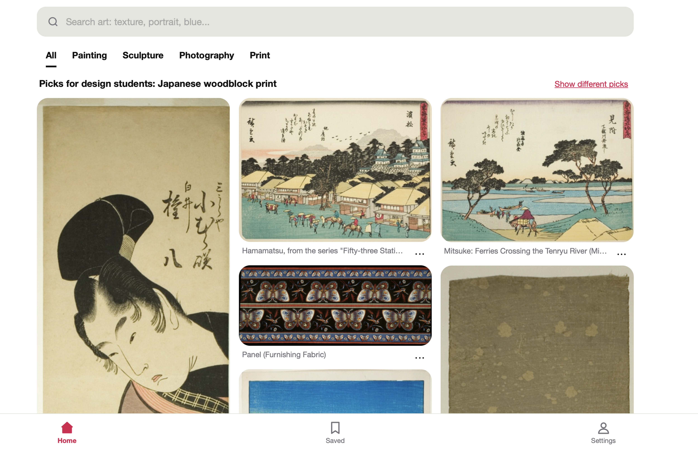

# Day 1 "before" snapshot

Write your own, even if you worked in a pair. Keep it: we come back to it at mid-quarter (Week 6) and at the end (Week 11). Your prompts go in `ai_log.md`, not here.

**Name: Gabriella Hipolito** 
**Partner (if any): Flora Yi**

## Before we prompted

### 1. Who is it for, and what do they want to do?

It's for _university students, majoring in art__ who want to _find art inspo for their assignments__.

**"The user can..." sentences:**
1. The user can search and filter to find specific pieces
2. The user can save pieces they like to view at later

### 2. Our sketch

Put the photo in this `hw0` folder, then change the filename below to match:

### 3. Our prediction

We expected the app would be similar to Pinterest. It would be an Art Finder that lets you search and filter pieces from the Chicago Art Museum

## What we got

### 4. What the AI made

Put the screenshot in this `hw0` folder, then change the filename below to match:

### 5. Sketch vs. app

- **Matches our sketch: Between the sketch and the app, the search bar, filter, and artwork locations match**

- **Different from our sketch: Something that different is the filter catagories are not in a round block. Also there aren't enough category options to scroll those options horizontally.**

- **The AI decided: Somethings the AI decided that my group never said was the "Picks for design students: X" line and the "Show different picks" option. AI also decided what the filter options would be, and the app's color scheme (red, white, black, and gray)** 

### 6. What did I keep, change, or reject, and why?

	Some changes we made from the original sketch to the app were changing the bottom navigation from having 2 options to 3. We also changed what those options would be. Originally it was just supposed to have an account tab and a settings tab. We realized account is part of settings, the tab showing all the artworks needs it's own icon (home), and that students would probably want a tab that shows all their saved artworks (saved). 

### 7. Explain back

Pick one part of the code. In your own words, what does it do?

	The search box has a timer on it that starts once the user stops typing. The timer resets if typing resumes. Once the timer reaches 400 ms, the photos shown on the home page update. This is so that the user hopefully gets more accurate photos of what they're actually looking for, rather than getting new photos updated after every letter they type. 

## Looking ahead

### 8. What does it do? Does it work? What broke?

	What does it do: Pinterest Dupe. Art finder that lets you search and filter pieces from Chicago Art Museum. Also lets you save artworks you want to see later. 
	
	Does it work: yes!
	
	What broke: we couldn't get the photos to load at first, but after downloading the html it worked. The nav bar was originally a little confusing to understand too, but was fixed with a more detailed follow up prompt

### 9. How much do I understand about how it works? (0–100%)

**My number: 60%**

**Why that number: Reading the code breakdown and looking at the code, I understand it for the most part, but I would not have been able to do that or really comprehend in detail the code without Claude's explanation**

### 10. What would I need to know to tell whether it's *well designed or well built*?

	To find out if something is well designed, I would need to know how others feel and interact with this app. If people would actually use it, and if it feels easy to use without frustrating crashes, errors, or bugs.
	
	It would be well built if someone who needs to look at the code or make adjustments would be able to understand its functions without having too much trouble

### 11. What do I hope to be able to do by week 10?
By week 10, I hope I have a more strategic and logical method of using AI to build apps. I also hope to learn some python, and know the basic code structure to build an app without AI. It would also be nice to get a firmer idea of exactly how AI will be implemented into tech/software/design engineering roles in the near future. 

